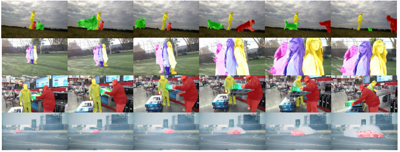

# TMVOS

  
  
  Video object segmentation (VOS) is a critical yet challenging task in video analysis. Recently, many pixel-level matching VOS methods have achieved an outstanding perfor-mance without significant time consumption in fine tuning. However, most of these methods pay little attention to i) matching background pixels and ii) optimizing discriminable embeddings between classes. To address these issues, we propose a new end-to-end trainable method, namely Triplet Matching for efficient semi-supervised Video Object Segmentation (TMVOS). In particular, we devise a new triplet matching strategy that considers both the foreground and background matching and pulls the nearest negative embedding further than the nearest positive one for every anchor. As a result, this method implicitly enlarges the distances between embeddings of different classes and thereby generates accurate matching maps. Additionally, a dual decoder is applied for optimizing the final segmentation so that the model better fits for the complex background and relatively simply targets.Extensive experiments demonstrate that the proposed method achieves the outstanding performance in terms of accuracy and running-time compared with the state-of-the-art methods.  
  
Some video segmentation results:

    
      
# Cite
Please cite our paper when you use our model and code. For more details about this paper, please refer to our paper "TMVOS: Triplet Matching for Efficient Video Object Segmentation" at https://www.sciencedirect.com/science/article/pii/S0923596522000947

[Plain Text]
-------------
    Jiajia Liu, Hong-Ning Dai, Guoying Zhao, Bo Li, Tianqi Zhang, TMVOS: Triplet Matching for Efficient Video Object Segmentation, Signal Processing: Image Communication, Volume 107, 2022, 116779, ISSN 0923-5965.

[BibTex]
-------------
    @article{LIU2022116779,
            author = {Jiajia Liu and Hong-Ning Dai and Guoying Zhao and Bo Li and Tianqi Zhang},
            title = {TMVOS: Triplet Matching for Efficient Video Object Segmentation},
            journal = {Signal Processing: Image Communication},
            volume = {107},
            pages = {116779},
            year = {2022},
            issn = {0923-5965},
            doi = {https://doi.org/10.1016/j.image.2022.116779},
            url = {https://www.sciencedirect.com/science/article/pii/S0923596522000947},
            keywords = {Video object segmentation, Embedding learning, Triplet matching},
    }

Master
=

--model  
-------------

Model : including TMVOS model (MPS) and residual network (RESNET)  

--src  
-------------
config : Parameter setting  

dataset_utils: dataset  

main ：Training procedures  

output_result： test  

plot_tSNE: dimension reduction and visualization  

  
    
    

Use  
=

Training：  
--------
python main.py  

Evaluation:  
--------
python output_result.py  

Model and Training details
--------
The trained model is available at https://drive.google.com/drive/folders/1bweLk5CNnHB6E8KC-CpxyNm6eEGM__fZ?usp=sharing

The training of the proposed TMVOS contains two stages: i) pre-training on MS COCO and ii) fine-tuning on the training set of DAVIS-2017. In the first stage, the previous frame’s mask and the first frame of training samples are synthesized from the static images following the practices in MSK and Lucid Dreaming. We pre-train the proposed model on the synthesized dataset for 3 epochs with the learning rate of 10−5. In the second stage, the first and current frames are randomly selected from a video, while the previous frame’s mask is selected from the masks near the target frame (i.e., we choose the maximum interval as three). We fine-tune the model on the samples of DAVIS2017 by choosing the learning rate as 10−6. All the experiments mentioned above minimize the cross-entropy loss by using Adam optimizer and are trained on a workstation equipped with an NVIDIA Titan XP.

