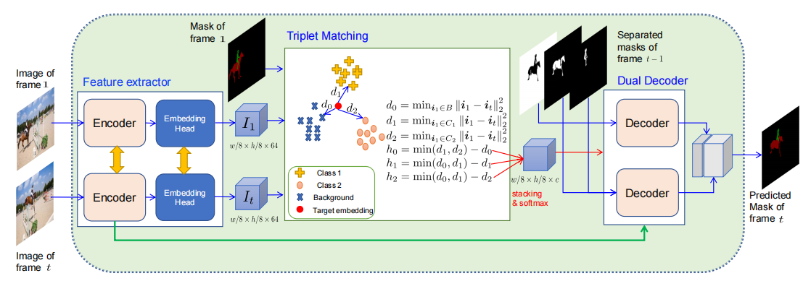

# TMVOS
TMVOS

  
  
  The architecture of TMVOS. For simplification, we assume the example video in the triplet matching block has two objects: two foreground classes
(i.e., Class 1 and Class 2) and a background class, where w and h denote the width and the height of the input images, respectively.  
    
      
      
Master

--model  

Model, including TMVOS model (MPS) and residual network (RESNET)  

--src  

config : Parameter setting  

dataset_utils: dataset  

main ：Training procedures  

output_result： test  

plot_tSNE: dimension reduction and visualization  

  
    
    

Use  

Training：  

python main.py  

Evaluation:  

python output_result.py  

